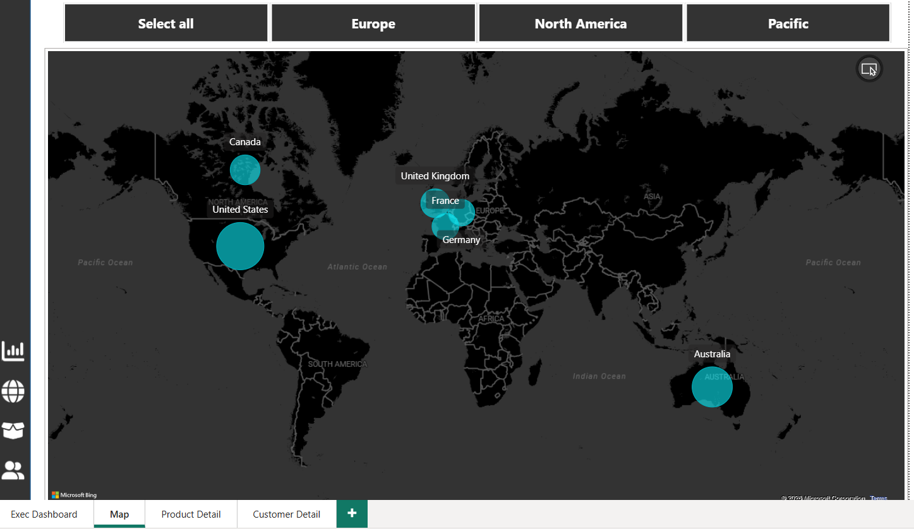

# Sales Performance Dashboard | Power BI

## One-Line Summary
Interactive Power BI dashboard analyzing revenue, profit, customer behaviour, product performance, and return trends to generate actionable business insights and support data-driven decision-making.

## Dashboard Overview
This project was developed using Microsoft Power BI to analyze overall business performance across sales, profitability, returns, customer segmentation, products, and regional markets.
The dashboard focuses on identifying business growth opportunities, operational inefficiencies, customer trends, and product-level performance using interactive visualizations and analytical insights.

## Tools & Technologies
- Microsoft Power BI 
- Power Query 
- DAX 
- Data Modelling 
- Interactive Dashboards & Visualizations

## Dashboard Features
- Revenue & Profit Trend Analysis 
- Return Rate Monitoring 
- Product Performance Analysis 
- Customer Segmentation Analysis 
- Regional Market Analysis 
- Interactive KPI Tracking 
- Dynamic Filtering & Drill-down Analysis

## Dashboard Screenshots

## Executive Dashboard 

## Map

## Product Detail

## Customer Detail

## Key Business Insights

## Revenue vs Customer Value Analysis
- Overall revenue increased steadily, while revenue per customer declined over time. 
- The trend indicates business growth was driven more by increased customer volume than higher customer spending.
  

## Seasonal Revenue & Profit Trends
- Revenue and profit showed a strong upward trend over time, with noticeable spikes during year-end periods. 
- The recurring increase indicates seasonal demand and stronger business performance during peak months.
  

## Return Rate Analysis
- Although the number of returns increased over time, the overall return percentage declined significantly.
- The trend indicates improved sales volume growth and better return management efficiency.
  

## Product Performance Insights
- Road Bikes and Mountain Bikes together contributed nearly 80% of total revenue, making them the dominant product segments. 
- Shorts recorded the highest return rate among all subcategories, indicating potential product or customer satisfaction concerns.
  

## Detailed Business Insights
Detailed business analysis, customer segmentation insights, operational recommendations, and regional performance observations are available in the accompanying Business_Insights.pdf document included in this repository.

## Repository Structure

- README.md
- Business_Insights.pdf
- Sales_Dashboard.pbix
- Dataset/
- Screenshots/

## Author

Developed as part of a Power BI Business Intelligence and Data Analytics portfolio project.

